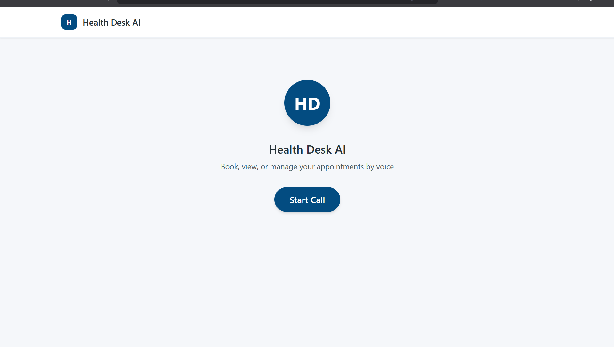
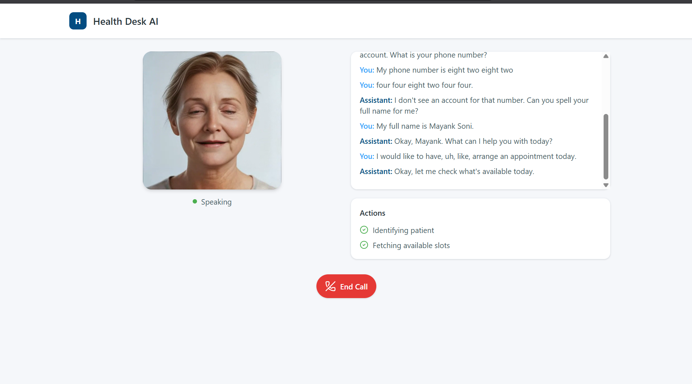
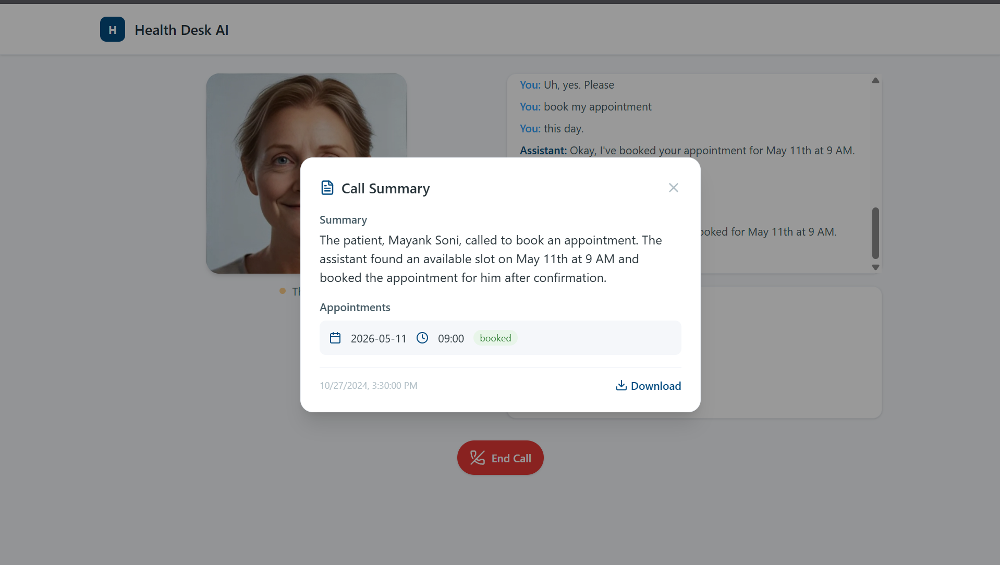

# Health Desk AI

A real-time AI voice agent for healthcare appointment management. Patients can book, view, modify, and cancel appointments through natural voice conversation with a talking avatar.





## Tech Stack

| Layer | Technology |
|-------|-----------|
| Voice Pipeline | [LiveKit Agents](https://docs.livekit.io/agents/) |
| Speech-to-Text | [Deepgram Nova-2](https://deepgram.com/) |
| Text-to-Speech | [Cartesia Sonic-2](https://cartesia.ai/) |
| LLM | [Gemini 2.0 Flash](https://ai.google.dev/) via [OpenRouter](https://openrouter.ai/) |
| Avatar | [Simli](https://simli.com/) |
| Turn Detection | LiveKit Multilingual EOU Model |
| VAD | Silero VAD |
| Backend | Python, FastAPI |
| Frontend | React, Vite, TypeScript, Tailwind CSS |
| Database | PostgreSQL 16 |
| Deployment | Docker Compose |

## Features

- Real-time voice conversation with < 3-5 second response latency
- Lip-synced talking avatar (Simli)
- 7 tool calls: identify_user, fetch_slots, book_appointment, retrieve_appointments, cancel_appointment, modify_appointment, end_conversation
- Live tool call status on UI ("Fetching slots...", "Booking appointment...")
- Live conversation transcript
- Call summary with appointment details and download option
- Double-booking prevention at database level
- Adaptive interruption handling (distinguishes real interruptions from "uh-huh")
- Semantic turn detection (knows "I want to book for..." is not a complete sentence)
- Rolling context management with token budgeting
- Healthcare-themed UI with trust blue palette

## Architecture

```
Browser (React + LiveKit SDK)
    ↕ WebRTC
LiveKit Cloud
    ↕
┌─────────────────────────────┐
│ Agent Worker (Python)        │
│  ├── Deepgram STT            │
│  ├── Gemini LLM (tools)      │
│  ├── Cartesia TTS            │
│  ├── Silero VAD              │
│  └── Simli Avatar            │
├─────────────────────────────┤
│ FastAPI (token generation)   │
├─────────────────────────────┤
│ PostgreSQL (appointments)    │
└─────────────────────────────┘
```

## Prerequisites

- Docker and Docker Compose
- API keys for: LiveKit Cloud, OpenRouter (or OpenAI), Deepgram, Cartesia, Simli

## Quick Start

### 1. Clone

```bash
git clone https://github.com/Mayank06711/health-desk-ai.git
cd health-desk-ai
```

### 2. Configure

Copy the example env and fill in your API keys:

```bash
cp backend/.env.example backend/.env
```

Edit `backend/.env` with your keys:

```env
RUNNING_IN_DOCKER=false

LIVEKIT_URL=wss://your-project.livekit.cloud
LIVEKIT_API_KEY=your-key
LIVEKIT_API_SECRET=your-secret

LLM_API_KEY=your-openrouter-key
LLM_BASE_URL=https://openrouter.ai/api/v1
LLM_MODEL=google/gemini-2.0-flash-001

DEEPGRAM_API_KEY=your-key
CARTESIA_API_KEY=your-key
CARTESIA_VOICE_ID=your-voice-id

SIMLI_API_KEY=your-key
SIMLI_FACE_ID=your-face-id

POSTGRES_USER=postgres
POSTGRES_PASSWORD=postgres
POSTGRES_DB=voice_agent

APP_ENV=development
LOG_LEVEL=INFO
```

### 3. Run with Docker

```bash
docker compose up -d --build
```

This starts 4 containers:
- **postgres** — PostgreSQL database (port 5433)
- **api** — FastAPI token server (port 8000)
- **agent** — LiveKit voice agent worker
- **frontend** — React app served by nginx (port 3000)

### 4. Open

Visit [http://localhost:3000](http://localhost:3000) and click **Start Call**.

### Run Locally (without Docker)

```bash
# Terminal 1: PostgreSQL
docker compose up -d postgres

# Terminal 2: Backend API
cd backend
python -m venv .venv && source .venv/bin/activate  # or .venv\Scripts\activate on Windows
pip install -r requirements.txt
python main.py download-files   # downloads turn detector model (~15MB, one time only)
python run_api.py

# Terminal 3: Agent Worker
cd backend
source .venv/bin/activate
python main.py dev

# Terminal 4: Frontend
cd frontend
npm install
npm run dev
```

> **Note:** `python main.py download-files` downloads the turn detector model to HuggingFace cache on first run. After that, set `LOCAL_MODELS_ONLY=true` to skip network checks: `LOCAL_MODELS_ONLY=true python main.py dev`

## Project Structure

```
health-desk-ai/
├── backend/
│   ├── app/
│   │   ├── agent/           # Voice agent, prompts, state & context managers
│   │   ├── api/             # FastAPI token server
│   │   ├── database/        # PostgreSQL models, abstract interface, seed
│   │   └── services/        # Appointment and summary business logic
│   ├── models/              # Pre-downloaded turn detector model
│   ├── main.py              # Agent worker entry point
│   ├── run_api.py           # API server entry point
│   └── Dockerfile
├── frontend/
│   ├── src/
│   │   ├── components/      # React components
│   │   ├── hooks/           # Custom hooks for data channels
│   │   ├── services/        # API client
│   │   └── types/           # TypeScript interfaces
│   └── Dockerfile
├── docker-compose.yml
└── assets/                  # Screenshots
```

## Tool Calls

| Tool | Description |
|------|-------------|
| `identify_user` | Looks up patient by phone number, creates if new |
| `fetch_slots` | Returns available appointment slots from database |
| `book_appointment` | Books a slot with double-booking prevention |
| `retrieve_appointments` | Lists patient's upcoming appointments |
| `cancel_appointment` | Cancels and frees the slot |
| `modify_appointment` | Reschedules to a new slot |
| `end_conversation` | Generates call summary and saves to database |

## Switching LLM Provider

Change 3 values in `backend/.env` — zero code changes:

```env
# OpenAI
LLM_API_KEY=sk-...
LLM_BASE_URL=https://api.openai.com/v1
LLM_MODEL=gpt-4o

# Anthropic via OpenRouter
LLM_API_KEY=sk-or-...
LLM_BASE_URL=https://openrouter.ai/api/v1
LLM_MODEL=anthropic/claude-sonnet-4-20250514
```
